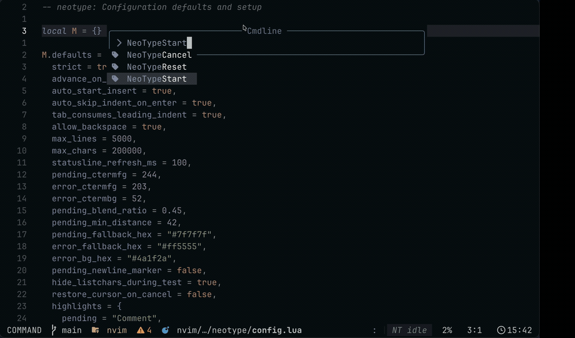

# NeoType

In-buffer Neovim typing trainer that runs directly on your current buffer without modifying underlying file contents.

## Demo


## Features
- Non-destructive typing overlay on the active buffer
- Pending/correct/error feedback while typing
- Start at current cursor position
- Vim motions remain available during session
- Optional lualine metadata (progress, WPM, accuracy, timer)

## Requirements
- Neovim 0.9+

## Installation (`lazy.nvim`)
```lua
{
  "rodolfo-arg/neotype",
  opts = {},
}
```

## Commands
- `:NeoTypeStart`
- `:NeoTypeReset`
- `:NeoTypeCancel`
- `:checkhealth neotype`

## Configuration
```lua
require("neotype").setup({
  auto_start_insert = true,
  auto_skip_indent_on_enter = true,
  tab_consumes_leading_indent = true,
  allow_backspace = true,
})
```

## Lualine Integration
```lua
{
  function()
    return require("neotype.lualine").component()
  end,
}
```

## Development Smoke Test
```bash
bash scripts/test-neotype-headless.sh
```
